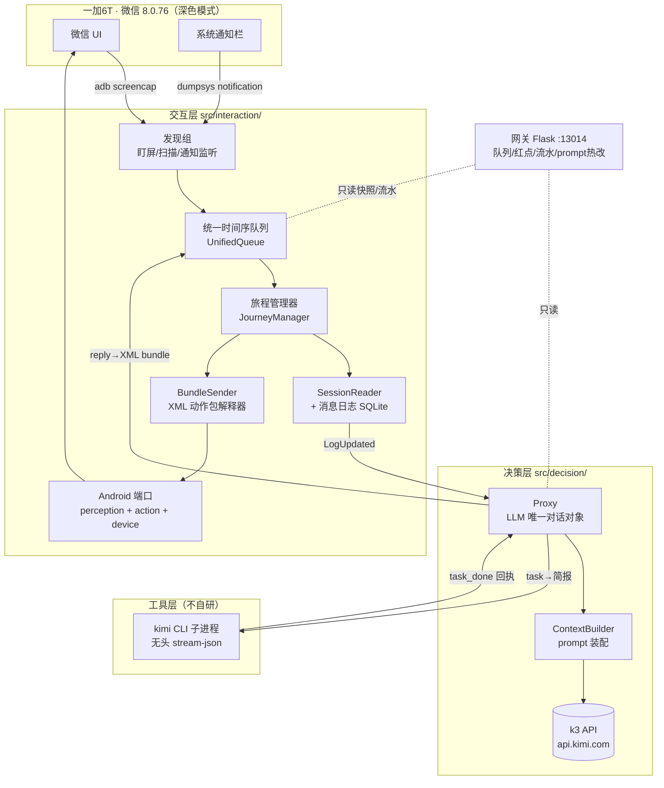
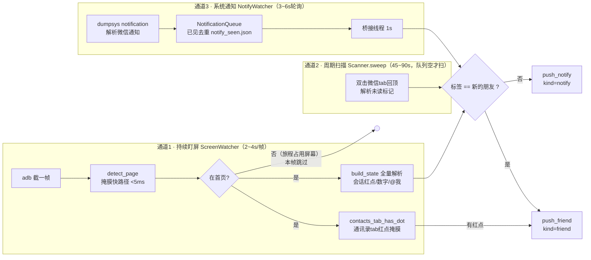
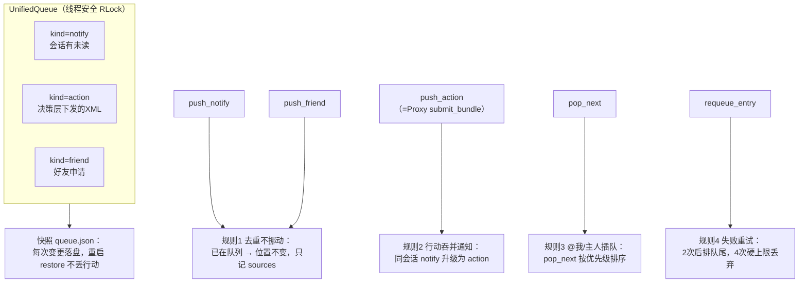
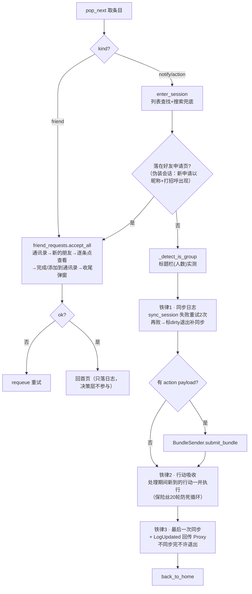
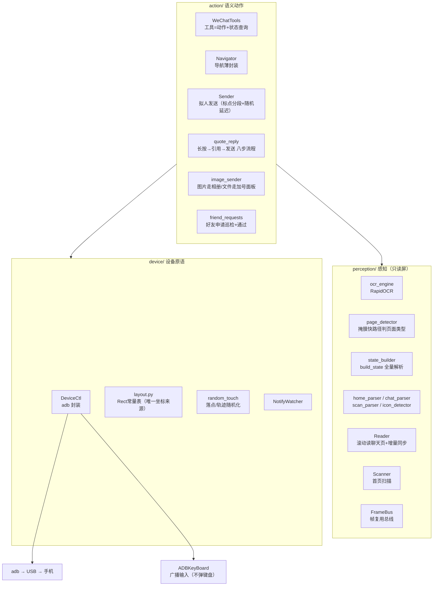
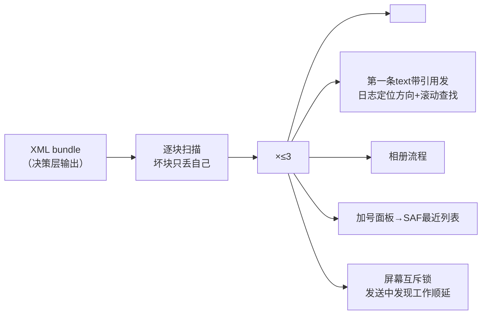
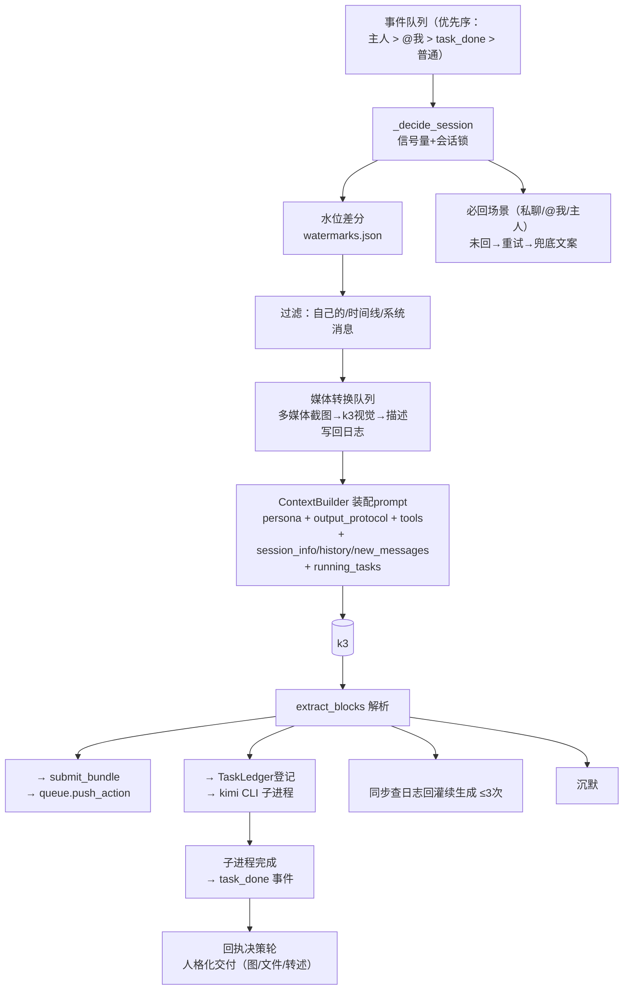
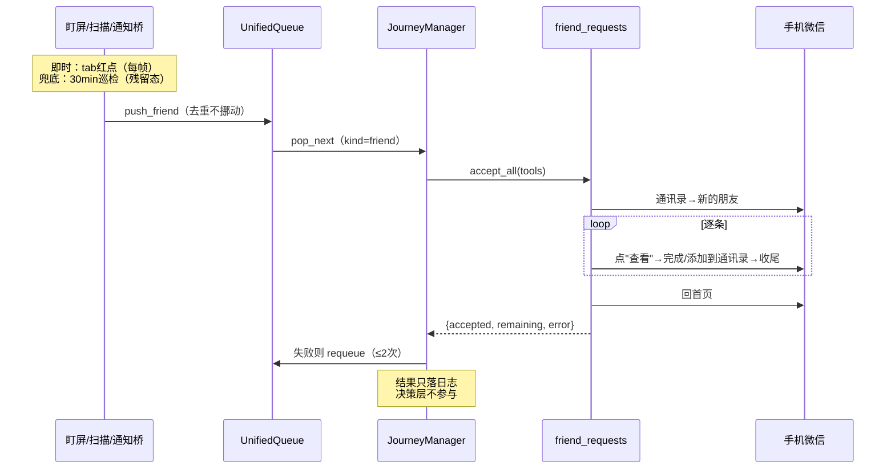
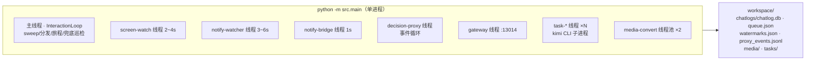

# 运行时架构详图（2026-08-09 实测版）

> 本文描述**当前代码实际运行时**的组件与数据流（Android 端口），
> 是 docs/ARCHITECTURE.md 总纲的落地详图。以 mermaid 绘制。
> 交互层是重点，按"发现 → 队列 → 旅程 → 端口"四段理解。

## 一、全局三层 + 网关

层间铁律：

- **交互层不组装 prompt、不调 LLM**（多媒体视觉标注例外，视为感知）
- **决策层不碰设备**：出向只有 `submit_bundle(session, xml)` 和 CLI 简报
- **工具层不碰手机**：只做电脑侧任务，交付物落盘回传路径
- 好友申请流程**全程在交互层**，决策层不参与（2026-08-09 用户定）

## 二、交互层 · 发现组（三条通道 + 收口）

要点：

- 盯屏与旅程**天然互斥**：屏幕不在首页就跳过，不用锁
- 好友申请的红点生命周期（用户实测）：tab 红点开一次通讯录就消；
  入口行红点开到详情才消；详情点开未通过 → 红点全消但申请还在。
  所以 tab 红点是**即时信号**，另加 30min **兜底巡检**抓残留态
- 乱逛（wander）**不许点通讯录 tab**——会把 tab 红点信号消掉

## 三、交互层 · 统一时间序队列

## 四、交互层 · 旅程（核心状态机）

## 五、交互层 · 端口（Android 适配器）

纪律：

- **触屏只准 `tap_rect(layout.XXX)` / `swipe_zone`**，裸坐标 tap 视为违规
- 截图即读即删（capture_bytes 内存流转，不落盘）
- perception 只读不写，action 只写不判（页面判断走 perception）

## 六、出向动作执行（BundleSender）

## 七、决策层 · Proxy 一轮决策

## 八、好友申请 · 完整信号流（2026-08-09 定稿）

## 九、运行时拓扑（进程/线程）

观测面（网关数据源全部只读）：`queue.json`（时序队列）、
`proxy_events.jsonl`（prompt/llm_output/route 流水）、
ops_journal（原子操作）、`/api/home_scan`（首页解析）、
`/api/task_done`（进程外补跑任务的结果注入）。
